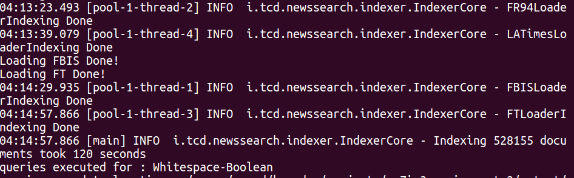

# cs7is3-assignment-2

##### Project developed under the coursework of  CS7IS3 - Information Retrieval and Web Search


##### Following is an implementation of the Apache Lucene Library (v7.5.0), written in Java.

#### The Dataset contains files from:

* The Financial Times Limited (1991, 1992, 1993, 1994)
* The Federal Register (1994)
* The Foreign Broadcast Information Service (1996)
* The Los Angeles Times (1989, 1990).

### Getting Started

These instructions will get you a copy of the project up and running on your local machine for development and testing purposes.

### Prerequisites

What things you need to install the software

```
Ubuntu OS
Maven 3.3.9
OpenJDK 1.8.0_242
GCC 5.4.0
```


### Building, Compiling, Creating the Index, Querying the Index and Using Trec-eval to compare scores.

* Clone this repository to your designated directory.
* Using a terminal - cd the cloned directory.

run following scripts from project root

* Run the following command, this will compile, index files and generate trec_eval results and same will be displayed on the terminal
```
sh run.sh
```

* Running following command will generate trec_results for the latest run
```
sh run_trec_eval.sh
```


You should be able to view the score on terminal.


### Results 

##### Combination of BM25 with Custom Analyzer performed Best, generating MAP of 0.3419


##### Comparison of Analyzers with BM25 Similarity


##### Indexing is done using multithreading which is completed in 120 seconds on average


##### Table of Trec Eval Results

| Similarity   |      Analyzer      |  MAP Score |
|----------    |:------------------:|-----------:|
| BM25         |  Custom            |      0.3419|
|              |  Standard          |      0.2672|
|              |  English           |      0.3221|
|              |  Simple            |      0.2657|
|              |  Stop              |      0.2652|
|              |  Whitespace        |      0.1986|
| Multi        |  Custom            |      0.3416|
|              |  Standard          |      0.2680|
|              |  English           |      0.3208|
|              |  Simple            |      0.2670|
|              |  Stop              |      0.2652|
|              |  Whitespace        |      0.1985|
| Classic      |  Custom            |      0.2030|
|              |  Standard          |      0.1824|
|              |  English           |      0.1920|
|              |  Simple            |      0.1789|
|              |  Stop              |      0.1777|
|              |  Whitespace        |      0.1457|
| LMDirichlet  |  Custom            |      0.2975|
|              |  Standard          |      0.2504|
|              |  English           |      0.2915|
|              |  Simple            |      0.2502|
|              |  Stop              |      0.2514|
|              |  Whitespace        |      0.2039|
| Boolean      |  Custom            |      0.1344|
|              |  Standard          |      0.0855|
|              |  English           |      0.0842|
|              |  Simple            |      0.0765|
|              |  Stop              |      0.0840|
|              |  Whitespace        |      0.0591|


##### References
Document Parsing Implementation and Query Parsing: [link](https://github.com/CS7IS3-A-Y-201718-IR2/text-search-engine-ir2)

Getting Started with Lucene: [link](https://www.manning.com/books/lucene-in-action) 
